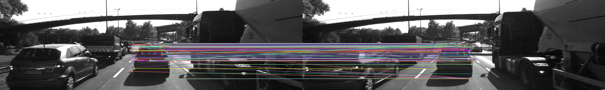
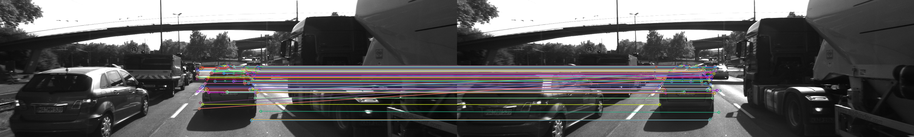

# SFND 2D Feature Tracking


The idea of the camera course is to build a collision detection system - that's the overall goal for the Final Project. As a preparation for this, you will now build the feature tracking part and test various detector / descriptor combinations to see which ones perform best. This mid-term project consists of four parts:

* First, you will focus on loading images, setting up data structures and putting everything into a ring buffer to optimize memory load. 
* Then, you will integrate several keypoint detectors such as HARRIS, FAST, BRISK and SIFT and compare them with regard to number of keypoints and speed. 
* In the next part, you will then focus on descriptor extraction and matching using brute force and also the FLANN approach we discussed in the previous lesson. 
* In the last part, once the code framework is complete, you will test the various algorithms in different combinations and compare them with regard to some performance measures. 

See the classroom instruction and code comments for more details on each of these parts. Once you are finished with this project, the keypoint matching part will be set up and you can proceed to the next lesson, where the focus is on integrating Lidar points and on object detection using deep-learning. 

## Dependencies for Running Locally
* cmake >= 2.8
  * All OSes: [click here for installation instructions](https://cmake.org/install/)
* make >= 4.1 (Linux, Mac), 3.81 (Windows)
  * Linux: make is installed by default on most Linux distros
  * Mac: [install Xcode command line tools to get make](https://developer.apple.com/xcode/features/)
  * Windows: [Click here for installation instructions](http://gnuwin32.sourceforge.net/packages/make.htm)
* OpenCV >= 4.1
  * This must be compiled from source using the `-D OPENCV_ENABLE_NONFREE=ON` cmake flag for testing the SIFT and SURF detectors.
  * The OpenCV 4.1.0 source code can be found [here](https://github.com/opencv/opencv/tree/4.1.0)
* gcc/g++ >= 5.4
  * Linux: gcc / g++ is installed by default on most Linux distros
  * Mac: same deal as make - [install Xcode command line tools](https://developer.apple.com/xcode/features/)
  * Windows: recommend using [MinGW](http://www.mingw.org/)

## Basic Build Instructions

1. Clone this repo.
2. Make a build directory in the top level directory: `mkdir build && cd build`
3. Compile: `cmake .. && make`
4. Run it: `./2D_feature_tracking`.

-----
# Wright up

## [Rubric](https://review.udacity.com/#!/rubrics/2549/view) Points






#### 1. Implement a vector for dataBuffer objects whose size does not exceed a limit (e.g. 2 elements). This can be achieved by pushing in new elements on one end and removing elements on the other end.
MidTermProject_Camera_Student.cpp
```c++
int dataBufferSize = 3;       // no. of images which are held in memory (ring buffer) at the same time
vector<DataFrame> dataBuffer; // list of data frames which are held in memory at the same time

// push image into data frame buffer
DataFrame frame;
frame.cameraImg = imgGray;
if  (dataBuffer.size() < dataBufferSize)
{  
    dataBuffer.push_back(frame);
    cout << "LOAD IMAGE INTO BUFFER done" << endl;
}  
else
{
    dataBuffer.erase(dataBuffer.begin());
    dataBuffer.push_back(frame);
    cout << "REPLACE IMAGE IN BUFFER done" << endl;
}
```

#### 2. Implement detectors HARRIS, FAST, BRISK, ORB, AKAZE, and SIFT and make them selectable by setting a string accordingly.
MidTermProject_Camera_Student.cpp
```c++
if (detectorType.compare("SHITOMASI") == 0)
{
    detKeypointsShiTomasi(keypoints, imgGray, false);
}
else if (detectorType.compare("HARRIS") == 0)
{
    detKeypointsHarris(keypoints, imgGray, false);
}
else 
{
    detKeypointsModern(keypoints, imgGray, detectorType, false);
}
```
matching2D_Student.cpp
```c++
//FAST, BRISK, ORB, AKAZE, SIFT
void detKeypointsModern(std::vector<cv::KeyPoint> &keypoints, cv::Mat &img, std::string detectorType, bool bVis)
{
    string windowName;
    if (detectorType.compare("FAST") == 0)
    {
        int threshold = 30;
        bool bNMS = true;
        cv::FastFeatureDetector::DetectorType type = cv::FastFeatureDetector::TYPE_9_16; // TYPE_9_16, TYPE_7_12, TYPE_5_8
        cv::Ptr<cv::FeatureDetector> detector = cv::FastFeatureDetector::create(threshold, bNMS, type);
        double t = (double)cv::getTickCount();
        detector->detect(img, keypoints);
        t = ((double)cv::getTickCount() - t) / cv::getTickFrequency();
        cout << "FAST detection with n= " << keypoints.size() << " keypoints in " << 1000 * t / 1.0 << " ms" << endl;
        windowName = "FAST  Detector Results";
    }  
    else if (detectorType.compare("BRISK") == 0)
    {
        cv::Ptr<cv::FeatureDetector> detector = cv::BRISK::create();
        double t = (double)cv::getTickCount();
        detector->detect(img, keypoints);
        t = ((double)cv::getTickCount() - t) / cv::getTickFrequency();
        cout << "BRISK detection with n= " << keypoints.size() << " keypoints in " << 1000 * t / 1.0 << " ms" << endl;
        windowName = "BRISK  Detector Results";
    }
    else if (detectorType.compare("ORB") == 0)
    {
        cv::Ptr<cv::FeatureDetector> detector = cv::ORB::create();
        double t = (double)cv::getTickCount();
        detector->detect(img, keypoints);
        t = ((double)cv::getTickCount() - t) / cv::getTickFrequency();
        cout << "ORB detection with n= " << keypoints.size() << " keypoints in " << 1000 * t / 1.0 << " ms" << endl;
        windowName = "ORB  Detector Results";
    }  
    else if (detectorType.compare("AKAZE") == 0)
    {
        cv::Ptr<cv::FeatureDetector> detector = cv::AKAZE::create();
        double t = (double)cv::getTickCount();
        detector->detect(img, keypoints);
        t = ((double)cv::getTickCount() - t) / cv::getTickFrequency();
        cout << "AKAZE detection with n= " << keypoints.size() << " keypoints in " << 1000 * t / 1.0 << " ms" << endl;
        windowName = "AKAZE  Detector Results";
    }  
    else if (detectorType.compare("SIFT") == 0)
    {
        cv::Ptr<cv::FeatureDetector> detector = cv::xfeatures2d::SIFT::create();
        double t = (double)cv::getTickCount();
        detector->detect(img, keypoints);
        t = ((double)cv::getTickCount() - t) / cv::getTickFrequency();
        cout << "SIFT detection with n= " << keypoints.size() << " keypoints in " << 1000 * t / 1.0 << " ms" << endl;
         windowName = "SIFT  Detector Results";
    }  
    // visualize results
    if (bVis)
    {
        cv::Mat visImage = img.clone();
        cv::drawKeypoints(img, keypoints, visImage, cv::Scalar::all(-1), cv::DrawMatchesFlags::DRAW_RICH_KEYPOINTS);
        cv::namedWindow(windowName, 6);
        imshow(windowName, visImage);
        cv::waitKey(0);
    }
}

// Detect keypoints in image using the traditional Harris detector
void detKeypointsHarris(std::vector<cv::KeyPoint> &keypoints, cv::Mat &img, bool bVis)
{
   // Detector parameters
    int blockSize = 2;     // for every pixel, a blockSize × blockSize neighborhood is considered
    int apertureSize = 3;  // aperture parameter for Sobel operator (must be odd)
    int minResponse = 100; // minimum value for a corner in the 8bit scaled response matrix
    double k = 0.04;       // Harris parameter (see equation for details)

    // Detect Harris corners and normalize output
    double t = (double)cv::getTickCount();
    cv::Mat dst, dst_norm, dst_norm_scaled;
    dst = cv::Mat::zeros(img.size(), CV_32FC1);
    cv::cornerHarris(img, dst, blockSize, apertureSize, k, cv::BORDER_DEFAULT);
    cv::normalize(dst, dst_norm, 0, 255, cv::NORM_MINMAX, CV_32FC1, cv::Mat());
    cv::convertScaleAbs(dst_norm, dst_norm_scaled);
  
    double maxOverlap = 0.0; // max. permissible overlap between two features in %, used during non-maxima suppression
    for (size_t j = 0; j < dst_norm.rows; j++)
    {
        for (size_t i = 0; i < dst_norm.cols; i++)
        {
            int response = (int)dst_norm.at<float>(j, i);
            if (response > minResponse)
            { // only store points above a threshold

                cv::KeyPoint newKeyPoint;
                newKeyPoint.pt = cv::Point2f(i, j);
                newKeyPoint.size = 2 * apertureSize;
                newKeyPoint.response = response;

                // perform non-maximum suppression (NMS) in local neighbourhood around new key point
                bool bOverlap = false;
                for (auto it = keypoints.begin(); it != keypoints.end(); ++it)
                {
                    double kptOverlap = cv::KeyPoint::overlap(newKeyPoint, *it);
                    if (kptOverlap > maxOverlap)
                    {
                        bOverlap = true;
                        if (newKeyPoint.response > (*it).response)
                        {                      // if overlap is >t AND response is higher for new kpt
                            *it = newKeyPoint; // replace old key point with new one
                            break;             // quit loop over keypoints
                        }
                    }
                }
                if (!bOverlap)
                {                                     // only add new key point if no overlap has been found in previous NMS
                    keypoints.push_back(newKeyPoint); // store new keypoint in dynamic list
                }
            }
        } // eof loop over cols
    }     // eof loop over rows
  
    t = ((double)cv::getTickCount() - t) / cv::getTickFrequency();
    cout << "Harris detection with n=" << keypoints.size() << " keypoints in " << 1000 * t / 1.0 << " ms" << endl;
 
    // visualize results
    if (bVis)
    {
        cv::Mat visImage = img.clone();
        cv::drawKeypoints(img, keypoints, visImage, cv::Scalar::all(-1), cv::DrawMatchesFlags::DRAW_RICH_KEYPOINTS);
        string windowName = "Harris Corner Detector Results";
        cv::namedWindow(windowName, 6);
        imshow(windowName, visImage);
        cv::waitKey(0);
    }
  
}
```
#### 3. Remove all keypoints outside of a pre-defined rectangle and only use the keypoints within the rectangle for further processing.
MidTermProject_Camera_Student.cpp
```c++
// only keep keypoints on the preceding vehicle
bool bFocusOnVehicle = true;
cv::Rect vehicleRect(535, 180, 180, 150);
vector<cv::KeyPoint>::iterator keypoint;
vector<cv::KeyPoint> keypoints_roi;
if (bFocusOnVehicle)
{
    for(keypoint = keypoints.begin(); keypoint != keypoints.end(); ++keypoint)
    {
        if (vehicleRect.contains(keypoint->pt))
        {  
            cv::KeyPoint newKeyPoint;
            newKeyPoint.pt = cv::Point2f(keypoint->pt);
            newKeyPoint.size = 1;
            keypoints_roi.push_back(newKeyPoint);
        }
    }
    keypoints =  keypoints_roi;
    cout << "IN ROI n= " << keypoints.size()<<" keypoints"<<endl;
}
```

#### 4. Implement descriptors BRIEF, ORB, FREAK, AKAZE and SIFT and make them selectable by setting a string accordingly.
MidTermProject_Camera_Student.cpp
```c++
string descriptorType = "SIFT"; // BRIEF, ORB, FREAK, AKAZE, SIFT
descKeypoints((dataBuffer.end() - 1)->keypoints, (dataBuffer.end() - 1)->cameraImg, descriptors, descriptorType);
```
matching2D_Student.cpp
```c++
// Use one of several types of state-of-art descriptors to uniquely identify keypoints
void descKeypoints(vector<cv::KeyPoint> &keypoints, cv::Mat &img, cv::Mat &descriptors, string descriptorType)
{
    // select appropriate descriptor
    cv::Ptr<cv::DescriptorExtractor> extractor;
    if (descriptorType.compare("BRISK") == 0)
    {

        int threshold = 30;        // FAST/AGAST detection threshold score.
        int octaves = 3;           // detection octaves (use 0 to do single scale)
        float patternScale = 1.0f; // apply this scale to the pattern used for sampling the neighbourhood of a keypoint.

        extractor = cv::BRISK::create(threshold, octaves, patternScale);
    }
    else if (descriptorType.compare("BRIEF") == 0)
    {
        extractor = cv::xfeatures2d::BriefDescriptorExtractor::create();
    }
    else if (descriptorType.compare("ORB") == 0)
    {
        extractor = cv::ORB::create();
    }
    else if (descriptorType.compare("FREAK") == 0)
    {
        extractor = cv::xfeatures2d::FREAK::create();
    }
    else if (descriptorType.compare("AKAZE") == 0)
    {
        extractor = cv::AKAZE::create();
    }
    else if (descriptorType.compare("SIFT") == 0)
    {
        extractor = cv::xfeatures2d::SIFT::create();
    }
    // perform feature description
    double t = (double)cv::getTickCount();
    extractor->compute(img, keypoints, descriptors);
    t = ((double)cv::getTickCount() - t) / cv::getTickFrequency();
    cout << descriptorType << " descriptor extraction in " << 1000 * t / 1.0 << " ms" << endl;
}
```

#### 5. Implement FLANN matching as well as k-nearest neighbor selection. Both methods must be selectable using the respective strings in the main function.
matching2D_Student.cpp
```c++
if (matcherType.compare("MAT_BF") == 0)
{
    int normType = cv::NORM_HAMMING;
    matcher = cv::BFMatcher::create(normType, crossCheck);
}
else if (matcherType.compare("MAT_FLANN") == 0)
{
    matcher = cv::DescriptorMatcher::create(cv::DescriptorMatcher::FLANNBASED);
}
```

#### 6. Use the K-Nearest-Neighbor matching to implement the descriptor distance ratio test, which looks at the ratio of best vs. second-best match to decide whether to keep an associated pair of keypoints.
matching2D_Student.cpp
```c++
// perform matching task
if (selectorType.compare("SEL_NN") == 0)
{ // nearest neighbor (best match)

    matcher->match(descSource, descRef, matches); // Finds the best match for each descriptor in desc1
}
else if (selectorType.compare("SEL_KNN") == 0)
{ // k nearest neighbors (k=2)
    vector<vector<cv::DMatch>> knn_matches;
    matcher->knnMatch(descSource, descRef, knn_matches, 2);
    double minDescDistRatio = 0.8;
    for (auto it = knn_matches.begin(); it != knn_matches.end(); ++it)
    {

        if ((*it)[0].distance < minDescDistRatio * (*it)[1].distance)
        {
            matches.push_back((*it)[0]);
        }
    }
    cout << "# keypoints removed = " << knn_matches.size() - matches.size() << endl;
}
```

#### 7. Count the number of keypoints on the preceding vehicle for all 10 images and take note of the distribution of their neighborhood size. Do this for all the detectors you have implemented.

| Detector | Number of detected Keypoints on the preceding vehicle for total of 10 images |
| --- | --- |
| **SHITOMASI** | 1179 |
| **HARRIS** | 560 |
| **FAST** | 1491 |
| **BRISK** | 2762 |
| **ORB** | 1161 |
| **AKAZE** | 1670 |
| **SIFT** | 1386 |

#### 8. The number of matched keypoints for all 10 images using all possible combinations of detectors and descriptors. In the matching step, the BF approach is used with the descriptor distance ratio set to 0.8.

| Detector\Descriptor | BRISK | BRIEF | ORB | FREAK | AKAZE | SIFT |
| --- | --- | --- |--- |--- |--- |--- |
| **SHITOMASI** | 767 |944|908|768|N/A|927|
| **HARRIS** | 393|460 |451|396|N/A|459|
| **FAST** | 899 |1099|1071|878|N/A|1046|
| **BRISK** | 1570 |1704|1514|1524|N/A|1646|
| **ORB** | 751 |545|763|420|N/A|763|
| **AKAZE** | 1215 |1266|1182|1187|1259|1270|
| **SIFT** | 592 |702|Out of Memory|593|N/A|800|

#### 9. Average Processing Time (ms) on all images for each detector/descriptor combination

| Detector\Descriptor | BRISK | BRIEF | ORB | FREAK | AKAZE | SIFT |
| --- | --- | --- |--- |--- |--- |--- |
| **SHITOMASI** | 17.98 |21.38|18.8|52.4079|N/A| 31.82|
| **HARRIS** | 16.98|17.11 |16.5383|51.01| N/A| 32.73|
| **FAST** | 3.36 |1.8786 |2.03823|41.549|N/A|35.71|
| **BRISK** | 43.736 |44.159|47.966|89.2|N/A|92.17|
| **ORB** | 8.54 |8.035|11.81|47.578|N/A|51.6748|
| **AKAZE** | 103.108 |81.3247|84.51|149.97|173.611|128.77|
| **SIFT** | 124.09 |146.49|Out of Memory|188.17|N/A|181.0381|

Based on the results above, the top 3 detector/descriptor combinations, that achieve minimal processing time with significant matches are:

DETECTOR/DESCRIPTOR  | NUMBER OF KEYPOINTS | TIME
-------------------- | --------------------| --------
FAST+BRIEF           | 1099 keypoints    | 1,87 ms 
FAST+ORB             | 1071 keypoints    | 2.03 ms 
FAST+BRISK           | 899 keypoints     | 3.36 ms 
